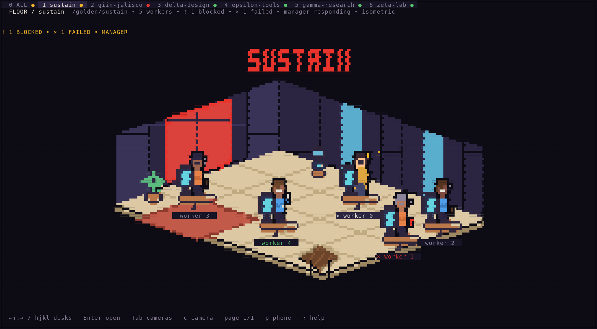
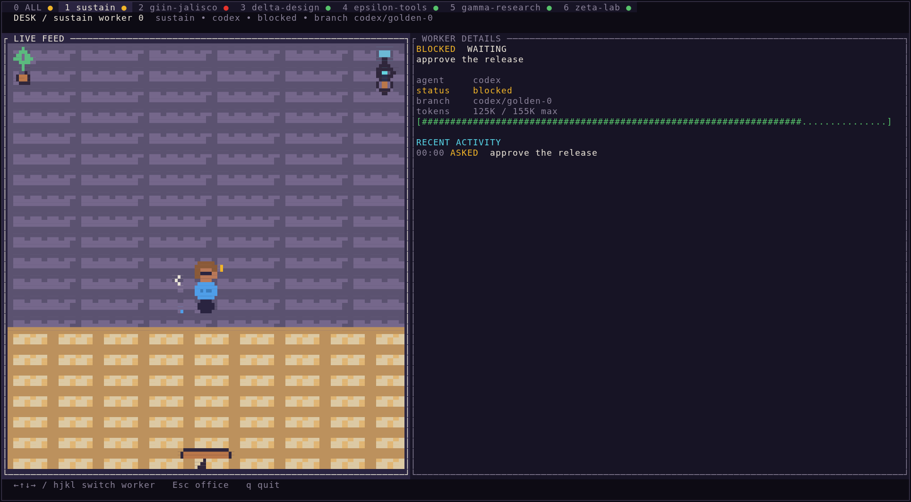

# they-work

> A virtual office for the AI coding agents already running on your machine.

You start three agents on a project and they scatter into separate threads.
`they-work` puts them back in one room: every thread is an employee at a desk,
typing, reading, editing, or waiting on you — drawn as pixel art in your
terminal. Every project you have open is another office, and one view is a wall
of camera feeds so you can watch all of them at once.

It only ever reads. It cannot start or stop your agents, write to their files,
or reach the network.

## Start here

Requires Docker and Git. Nothing else — no Rust, no toolchain, nothing installed
on your machine.

~~~bash
git clone https://github.com/Giuseppecarte/they-work
cd they-work
make demo
~~~

`make demo` shows an imaginary company and **reads nothing from your disk**, so
it is the safe way to see what this is before pointing it at your own work.

When you are happy:

~~~bash
make run
~~~

That mounts your agent directories read-only, with no network, and shows your
real projects.

### Look before you leap

Two commands print and exit, without drawing anything:

~~~bash
make build
docker run --rm --user "$(id -u):$(id -g)" --network none \
  -v "$HOME/.claude:/data/claude:ro" -v "$HOME/.codex:/data/codex:ro" \
  they-work:local --doctor
~~~

`--doctor` says which agents it found, where, how much they hold, and — when
something is wrong — what to do about it. Swap `--doctor` for `--once` to get
every office and worker as plain text, blocked ones first. Both are useful over
SSH, in a pipe, or when the office looks emptier than you expected.

## What you are looking at

| View | Key | What it is |
| --- | --- | --- |
| **The floor** | default | one project as an isometric office, a desk per thread |
| **The guard office** | `Tab` or `0` | every project at once, each behind its own camera pane |
| **A desk** | `Enter` | one worker up close, with their timeline |
| **The phone** | `p` | a messaging app: standup, blocked, shipping, watercooler |
| **Settings** | `s` | camera, light, theme, colour depth, motion |
| **Help** | `?` | every key |

Tabs across the top switch offices; `1`–`9` jump straight to one. A tab's dot
turns amber the moment anyone in that project is blocked, even while you are
looking somewhere else.

Colour means the same thing everywhere. **Shirt** is which agent — orange for
Claude Code, blue for Codex. The **bar under a name** is status: green running,
grey idle, amber blocked, red failed. Amber appears nowhere else in the
interface, so if you see it, someone is waiting on you.

## What it reads, and what you are agreeing to

The collectors have a narrow, read-only input boundary:

- **Claude Code** — regular `.jsonl` session files below `~/.claude/projects/`.
  Symlinks and non-JSONL files are skipped.
- **Codex** — the SQLite databases `~/.codex/sqlite/state_5.sqlite` and
  `~/.codex/sqlite/thread_history_1.sqlite`, opened in SQLite's read-only mode.

Those records contain your prompts, the commands your agents ran, file paths,
their messages back, thread titles, branches and token counts. All of it is
displayed on screen, so treat the terminal as having the same sensitivity as
those files. The collectors read filesystem metadata and `.git` markers to group
activity under a project root; they never read your project's source.

A missing agent is normal — the other one carries on. If a store lives somewhere
unusual, point `THEYWORK_CLAUDE_HOME` or `THEYWORK_CODEX_HOME` at it. Codex on
the Windows side while you run in WSL is common enough that discovery looks for
it under `/mnt/*/Users/*` on its own.

The flags in `make run` are deliberately visible:

- `--network none` — the process has no network interface at all
- `--read-only` — the container filesystem cannot be written
- `--cap-drop ALL` and `--security-opt no-new-privileges`
- `:ro` on both agent mounts
- `--user` your own uid, so it reads exactly what you can read and no more
- `--rm` — nothing persists when you quit

Building the image uses Docker's normal network access to pull base images. That
is separate from the running program, which has none.

## What is inside

Five crates. `theywork-core` is the contract; the collectors and the renderer
both depend on it and neither depends on the other.

| Crate | Does |
| --- | --- |
| `theywork-core` | the domain model — offices, workers, activities, events, status |
| `theywork-collect` | read-only readers for Claude Code and Codex |
| `theywork-render` | the pixel canvas, sprites and views |
| `theywork-terminal-image` | Kitty and Sixel transport for terminals that can show images |
| `theywork-tui` | the binary: arguments, discovery, the frame loop |

Data flows one way. A collector tails a transcript or reads a database and emits
normalised events; `World` folds those into offices and workers; the renderer
draws whatever `World` currently says. Nothing downstream parses an agent's
format, and nothing upstream knows how anything is drawn.

The picture is built from **half-block, quadrant or sextant characters**,
whichever your terminal and font support — up to six pixels and two colours in
every cell. On a 160×48 terminal that is a 320×144 image.

The intended design for every surface lives in [`docs/design/`](docs/design) as
plain HTML you can open in a browser. Where the code and a board disagree, the
board is what was meant.

## Configuration

| Flag | |
| --- | --- |
| `--project <path>` | open one project |
| `--all` | start on the guard office |
| `--demo` | the imaginary company; reads nothing |
| `--doctor` | report what was found, then exit |
| `--once` | report every office and worker, then exit |
| `--view iso\|top\|side` | starting camera |
| `--light` / `--dark` | starting appearance |
| `--color auto\|true\|256\|none` | colour depth |
| `--config-dir <path>` | opt in to remembering settings |
| `--headless --exit-after <dur>` | run the loop without a terminal |

| Variable | |
| --- | --- |
| `THEYWORK_CLAUDE_HOME` | where Claude Code's data is |
| `THEYWORK_CODEX_HOME` | where Codex's data is |
| `THEYWORK_COLOR` | force a colour depth |
| `NO_COLOR` | honoured above everything else |

Nothing is written to disk unless you pass `--config-dir`.

## Working on it

~~~bash
make check   # format, clippy, and the full test suite
make shot    # render every surface beside its intended design
~~~

`make shot` writes `docs/shots/index.html`, which puts each rendered view next to
its design reference. That comparison is how visual changes get reviewed — the
frames are generated rather than stored, so what you open is always the code you
have checked out.

You do not need Rust installed; `scripts/cargo` runs the toolchain in a
container as you. See [CONTRIBUTING.md](CONTRIBUTING.md).

## License

MIT
