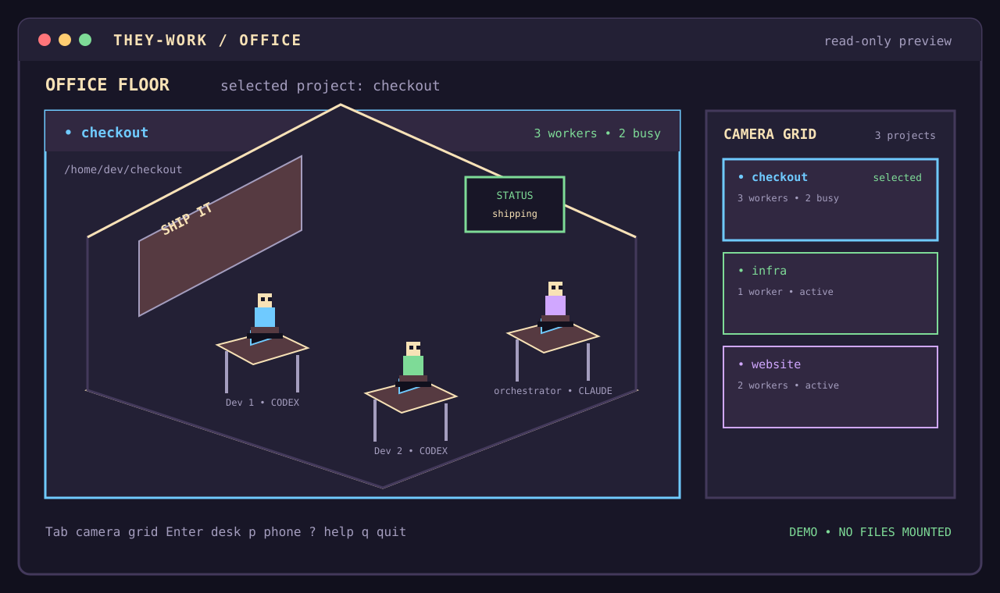

# they-work

> A read-only terminal office for Claude Code and Codex: local agent activity becomes a small, explorable pixel-art world.

`they-work` observes local agent activity and renders it on screen. It does
not start or stop agents, write to their files, or use the network.

## Try it without a checkout

Once a version tag has been published, its image is the fastest way to see the
office. It requires Docker, but not Git, Rust, Make, or a local checkout:

~~~bash
curl -fsSL https://raw.githubusercontent.com/Giuseppecarte/they-work/main/docs/install.sh | sh
~~~

Pin a release with `THEYWORK_IMAGE=ghcr.io/giuseppecarte/they-work:v1.2.3`.
The installer mounts existing `~/.claude` and `~/.codex` directories read-only,
skips homes that are absent, and starts an empty office when neither exists.
Set `THEYWORK_CLAUDE_HOST` or `THEYWORK_CODEX_HOST` for non-standard host paths.
See [`docs/release.md`](docs/release.md) for the release workflow and exact
Windows/WSL example.

## Quick look from a checkout

The current supported path requires Docker and a checkout. The deterministic
demo is:

~~~bash
git clone https://github.com/Giuseppecarte/they-work
cd they-work
make demo
~~~

The demo mounts no agent directories and reads no local agent data.

*A conceptual interface overview, not a renderer screenshot. It reads nobody's
files.*

## Reviewable frames

Open the [review contact sheet](docs/shots/index.html) for all four surfaces,
the intended-design reference slots, and dark/light PNG outputs at the fixed
demo timestamp. `make shot` is the one command that regenerates it. PNG export
rasterizes the exact SVG through Google Chrome or Chromium, whose font fallback
preserves spaces, bullets, and box-drawing characters. The generated PNGs are
ordinary images and need no Rust or browser toolchain to view; set
`THEYWORK_SVG_RASTERIZER` when the browser executable is not on `PATH`.
The contact sheet shows the primary normal golden at 160×48 beside the degraded
80×24 golden, and labels every rendered panel with its terminal size.

The desk frame is presentable enough for review, but the floor frame is not;
the renderer is still being brought into line with the supplied designs. Hold
both renderer shots out of the README until the floor comparison is right.
That is the moment to add the floor and desk PNGs from the same `make shot`
run; rerunning that one command whenever frame art changes keeps the README
art and review bundle aligned.

## Watch your agents

The local-data run explicitly mounts the two agent homes read-only:

~~~bash
make run
~~~

This is equivalent to mounting `~/.claude` at `/data/claude` and `~/.codex` at
`/data/codex` with `:ro`, then starting the local image with the hardened
runtime flags. The exact hand-run command is in [INSTALL.md](INSTALL.md).

## What it shows

The interface is organized around one selected project at a time:

| View | What you see |
| --- | --- |
| Office floor (default) | One project, its desks, worker status, activity, branch, and token summary. |
| Camera grid | Every discovered project as a compact feed, for comparing projects and switching the selected one. |
| Desk detail | The selected worker's current activity and recent history inside the selected project. |

Use `Tab` to switch between the selected office floor and the camera grid.
In the grid, arrows or `h`/`j`/`k`/`l` select a project and `Enter` opens its
floor. In the floor, `Enter` opens the selected desk; `Esc` or `Backspace`
returns to the parent view. Press `p` for the phone overlay, whose channels are
`#standup`, `#blocked`, `#shipping`, and `#watercooler`; choose them with
`1`–`4` or the arrow/hjkl keys. Press `?` for the key-reference overlay.

## Which project am I looking at?

Use `--project <path>` to choose a project at startup. The path may be relative
to the process working directory or absolute. It is normalized in the same way
as collector paths, and a path inside a Git worktree resolves to that
worktree's root. The selected root is matched against the normalized project
identity reported by the collectors.

Without `--project`, startup follows this order:

1. If the current directory belongs to one discovered project, open that
   project's office floor.
2. Otherwise, if projects were discovered, show the project picker. It lists a
   stable project name and full normalized path; `Enter` selects one.
3. If there is no usable picker, or the picker is dismissed, show every
   discovered project in the camera grid. If none were found, show an empty
   grid and the setup hint instead of pretending a project exists.

The camera grid is also the switching mechanism after startup: `Tab` opens it,
the movement keys select a different project, and `Enter` makes that project
the single office floor. See the precise state and path-matching contract in
[`docs/project-selection.md`](docs/project-selection.md).

### Remembering a choice

The default is deliberately non-persistent. `--project` is the whole story,
so the standard container still writes nothing and needs no writable config
mount. The cost is that a user who works across several projects repeats the
flag or selects from the grid on each run.

The recommended opt-in extension is `--config-dir <path>`. When supplied, the
program may read and update one small selection file in that directory; when it
is absent, it must not read or write a preference anywhere. In the container,
the user must explicitly mount that directory read-write. This trades one
narrow, visible write permission for convenience; the file contains a project
path, not agent transcripts. An explicit `--project` wins for the current run.
See [the full persistence contract](docs/project-selection.md#remembering-a-choice).

## What it reads and what you are agreeing to

The collectors have a narrow, read-only input boundary:

- Claude Code: regular `.jsonl` session files below
  `~/.claude/projects/`. Symlinks and non-JSONL files are skipped.
- Codex: the SQLite databases `~/.codex/sqlite/state_5.sqlite` and
  `~/.codex/sqlite/thread_history_1.sqlite`, opened with SQLite's read-only
  mode.

Those records can contain your prompts, commands, file paths, agent messages,
thread titles, branches, token counts, and status metadata. The corresponding
activity and message text is displayed in the terminal, so treat the screen as
having the same sensitivity as those files. The collectors inspect filesystem
metadata and `.git` directory markers to group activity under a project root;
they do not read your project source files.

Missing homes are normal: the unavailable collector is skipped, the other one
continues, and the camera grid can be empty. If a home lives somewhere unusual,
set `THEYWORK_CLAUDE_HOME` or `THEYWORK_CODEX_HOME` to the path visible inside
the container and mount that path read-only. For example, when Codex data is on
the Windows side while Docker runs in WSL:

~~~bash
docker run --rm -it --network none --read-only --cap-drop ALL \
  --security-opt no-new-privileges \
  -v /mnt/c/Users/PC/.codex:/data/codex:ro \
  -e THEYWORK_CODEX_HOME=/data/codex \
  they-work:local
~~~

Use the path syntax understood by the Docker daemon. The path on the right of
the mount is the value the program must receive. With Docker's short `-v`
syntax, a missing host path can be created as an empty directory; use an
explicit existing path or long `--mount` syntax if you want Docker to fail
instead. The demo command avoids this issue because it mounts nothing.

The runtime flags are intentionally visible in the command above:

- `--network none` gives the process no network interface;
- `--read-only` makes the container root filesystem read-only;
- `--cap-drop ALL` drops all Linux capabilities;
- `--security-opt no-new-privileges` prevents privilege elevation;
- `:ro` makes both agent mounts read-only;
- the image runs as `watcher` (UID `10001`), not root; and
- `--rm` removes the stopped container.

Image construction may need Docker's normal access to pull base images. That is
separate from the running application's no-network boundary.

## Check the setup before trusting it

The planned non-rendering CLI check is `--check`. It performs one collector
scan, never enters raw mode or the alternate screen, and prints stable lines of
the following form:

~~~text
claude_home=found path=/data/claude
codex_home=missing path=/data/codex
projects=2
workers=6
~~~

It reports both configured homes, the discovered project count, and the worker
count seen in that first scan. Exit status is `0` when at least one home is
available, `1` when neither home is available or a collector fails, and `2` for
invalid CLI arguments. Run it with the same read-only mounts before starting the
interactive view:

~~~bash
docker run --rm \
  --network none --read-only --cap-drop ALL \
  --security-opt no-new-privileges \
  -v "$HOME/.claude:/data/claude:ro" \
  -v "$HOME/.codex:/data/codex:ro" \
  they-work:local --check
~~~

`--check` is a CLI contract for the crate owner to implement; it is specified
here and intentionally is not implemented by this packaging change. Details
and acceptance cases are in [`docs/project-selection.md`](docs/project-selection.md).

## Configuration

The application reads these environment variables at startup:

| Variable | Meaning |
| --- | --- |
| `THEYWORK_CLAUDE_HOME` | Claude data root. The container default is `/data/claude`. |
| `THEYWORK_CODEX_HOME` | Codex data root. The container default is `/data/codex`. |
| `THEYWORK_COLOR=none` | Force monochrome block rendering. |
| `THEYWORK_COLOR=true` | Force truecolor rendering. |
| `THEYWORK_COLOR=256` | Force the 256-color palette. |
| `NO_COLOR` | Any presence forces monochrome and takes precedence over `THEYWORK_COLOR`. |

Without a forced color setting, `COLORTERM=truecolor` or `COLORTERM=24bit`
selects truecolor; other terminals use the 256-color palette. For example:

~~~bash
THEYWORK_COLOR=none make run
NO_COLOR=1 make run
~~~

## Contributor path

If you want to build or change the project, clone it and use the containerized
toolchain:

~~~bash
git clone https://github.com/Giuseppecarte/they-work
cd they-work
make demo
~~~

See [INSTALL.md](INSTALL.md) for Docker, source builds, and troubleshooting,
and [CONTRIBUTING.md](CONTRIBUTING.md) for crate boundaries, collector safety,
and the containerized checks.

## Project metadata

Description: A read-only terminal office for Claude Code and Codex, rendered as
pixel art.

Suggested topics: `rust` · `terminal-ui` · `tui` · `pixel-art` ·
`developer-tools` · `observability` · `claude-code` · `codex`

## License

See [LICENSE](LICENSE).
