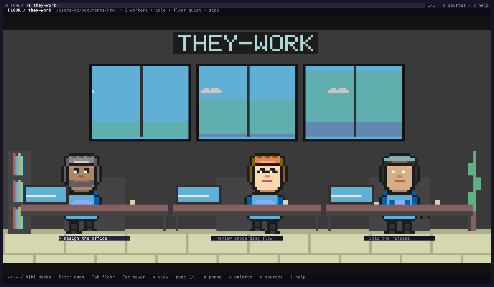
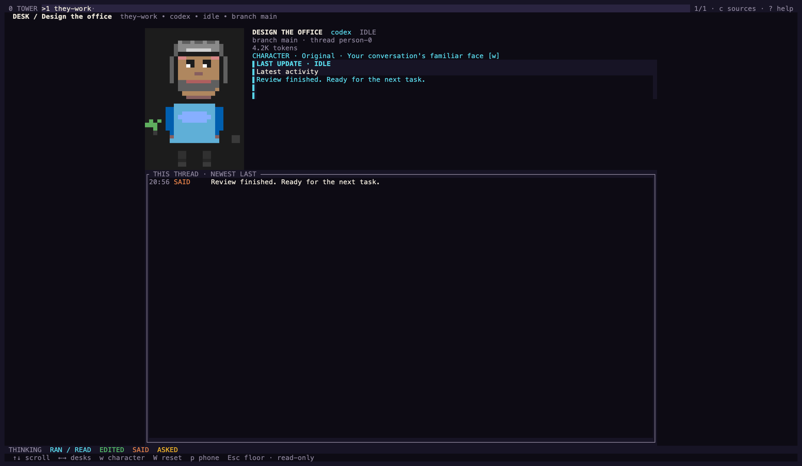

# they-work

> A virtual office for the AI coding agents already running on your machine.

You start three agents on a project and they scatter into separate threads.
`they-work` puts them back in one room: every thread is an employee at a desk,
typing, reading, editing, or waiting on you — drawn as pixel art in your
terminal. Each project occupies an independent floor in a software tower, so
you can see the whole company or inspect one worker's activity.

It reads agent transcripts and main database contents. It cannot start or stop
your agents, alter those records, or reach the network. On a writable native
SQLite store, SQLite may update an already-existing `-shm` coordination sidecar;
the container mounts stores read-only, and a cold WAL store without its existing
sidecars is refused rather than created.

The previews replay native macOS PTY output at 192×58 terminal cells through
CoreText with the installed Menlo font, half blocks and 256 colors. They are
font replays, not screenshots of Terminal.app. The [audit](docs/design-audit/iteration-2/REVIEW.md)
records the resize cases and evidence limits.

## Start here

Run a native terminal office on macOS, Linux, Windows, or WSL. From this
checkout, with Rust 1.90+ and a C compiler installed:

~~~sh
cargo install --locked --path crates/theywork-tui
they-work --demo
~~~

Press `q` to quit. The demo is an imaginary company and reads no conversation
data. To choose where your real conversations come from:

~~~sh
they-work --setup
~~~

Select Codex, Claude Code, both, or no local sources. This connects local
conversation folders; no account login or API key is required. Each project
gets its own office floor and each conversation a worker you can inspect.

The [installation guide](INSTALL.md) covers compiler setup, custom data paths,
Windows PowerShell, WSL, and Docker. Native installers and a six-platform release
workflow are included on this branch; those assets have **not been published**.
The older `v0.1.0` image does not contain these changes.

For this version without local Rust, use Docker from a checkout:

~~~sh
make demo
make run
~~~

`make demo` mounts nothing. `make run` mounts existing conversation homes
read-only and disables network access. The first launch asks which local sources
may be read. Keep **Remember on this computer** selected to reconnect next time,
or turn it off for a temporary session. `they-work --doctor` checks chosen sources;
`they-work --once` prints projects and workers. Without a saved choice, add
`--sources all`, `codex`, or `claude`; no conversations are read without a choice.
For Docker, use `make run ARGS="--sources all --doctor"` or
`ARGS="--sources all --once"`.

## What you are looking at

| View | Key | What it is |
| --- | --- | --- |
| **The tower** | `0` | all projects and attention counts; the starting view when no floor is selected |
| **The floor** | `Enter` from the tower | one project's office, with a desk per conversation |
| **A desk** | `Enter` | one worker up close, with their timeline |
| **The phone** | `p` | a messaging app: standup, blocked, shipping, watercooler |
| **Settings** | `s` | camera, light, theme, colour depth, motion |
| **Help** | `?` | every key |
| **Sources** | `c` | choose local providers and folders |

`Tab` / `Shift+Tab` cycle floors; `1`–`9` jump straight to one. In the tower,
`PageUp` / `PageDown` reach additional floors; `Enter` opens the selected floor.
Press `!` to jump to a worker needing attention, or `c` to change sources. A tab's dot
turns amber the moment anyone in that project is blocked, even while you are
looking somewhere else.

Use `v` to change the camera, `w` at a desk to change that worker's character,
and `o` to change the selected floor's palette. `W` and `O` restore defaults.
Keep **Remember on this computer** enabled when connecting to save these choices
and the selected floor. `--no-save` keeps changes temporary. Git worktrees of the
same repository share one floor.

Colour means the same thing everywhere. **Shirt** is which agent — orange for
Claude Code, blue for Codex. The **bar under a name** is status: green running,
grey idle, amber needs attention, red failed. Explicit questions and approval
requests appear immediately. Silence during an open turn also raises an
attention hint; inspect the desk to distinguish it from a confirmed request.
Approve requests in the original coding app.

## What it reads, and what you are agreeing to

The collectors have a narrow, read-only input boundary:

- **Claude Code** — regular `.jsonl` session files below `~/.claude/projects/`.
  Symlinks and non-JSONL files are skipped.
- **Codex** — `state_5.sqlite` and `thread_history_1.sqlite` inside `~/.codex`
  or its `sqlite/` subdirectory, opened in SQLite's read-only mode. Each current
  root-level database takes priority over an older copy in `sqlite/`.

The main databases and transcripts are not changed. SQLite can coordinate
through an existing `-shm` sidecar when a native store is writable; the Docker
commands mount stores read-only, and the program refuses a cold WAL-mode store
whose required `-wal`/`-shm` sidecars are absent rather than creating them.

Those records contain your prompts, the commands your agents ran, file paths,
their messages back, thread titles, branches and token counts. All of it is
displayed on screen, so treat the terminal as having the same sensitivity as
those files. The collectors read filesystem metadata and `.git` markers to group
activity under a project root; they never read your project's source.

A missing agent is normal — the other one carries on. If a store lives somewhere
unusual, point `THEYWORK_CLAUDE_HOME` or `THEYWORK_CODEX_HOME` at it. Codex on
the Windows side while you run in WSL is common enough that discovery looks for
it under `/mnt/*/Users/*` on its own.

The flags in `make run` are deliberately visible:

- `--network none` — no external network connectivity; container loopback remains
- `--read-only` — the container filesystem cannot be written
- `--cap-drop ALL` and `--security-opt no-new-privileges`
- `readonly` on each existing agent mount
- `--user` your own uid, so it reads exactly what you can read and no more
- `--rm` — nothing persists when you quit

Building the image uses Docker's normal network access to pull base images. That
is separate from the running program, which has none.

## What is inside

Five crates. `theywork-core` is the contract; the collectors and the renderer
both depend on it and neither depends on the other.

| Crate | Does |
| --- | --- |
| `theywork-core` | the domain model — offices, workers, activities, events, status |
| `theywork-collect` | read-only readers for Claude Code and Codex |
| `theywork-render` | the pixel canvas, sprites and views |
| `theywork-terminal-image` | Kitty and Sixel transport for terminals that can show images |
| `theywork-tui` | the binary: arguments, discovery, the frame loop |

Data flows one way. A collector tails a transcript or reads a database and emits
normalised events; `World` folds those into offices and workers; the renderer
draws whatever `World` currently says. Nothing downstream parses an agent's
format, and nothing upstream knows how anything is drawn.

Without a graphics protocol, the picture is built from **half-block, quadrant
or sextant characters**, whichever your terminal and font supports. Terminal
on macOS defaults to half blocks to avoid gaps in its usual font geometry.
Use Settings to compare encodings with your own font. The room adjusts to the
window and pages its workers when there is insufficient space for everyone.

When a graphics protocol is negotiated and the terminal reports its cell
geometry, the renderer makes one source pixel per physical terminal pixel in
the covered rectangle. Sixel, Kitty graphics, and iTerm2 inline PNG all receive
that renderer frame. For example, a 160×86 covered cell rectangle in a
terminal reporting 10×10-pixel cells produces a 1600×860 image. If the cell
geometry is unavailable, the program keeps the character renderer; the final
dimensions always come from the terminal report, not this example.

| Platform path | Status tested in this worktree |
| --- | --- |
| Windows Terminal under WSL, Sixel | Encoding and renderer frames are covered by tests. No Windows/WSL graphical terminal session was available for this audit, which ran on macOS. |
| macOS, Kitty protocol | Kitty encoding and the true-density renderer frame are covered by tests, but visual output was **not tested**: no Kitty graphics session was exercised; see the current audit for native macOS checks. |
| macOS, iTerm2 inline images | iTerm2 encoding and the true-density renderer frame are covered by tests, but visual output was **not tested**: no iTerm2 graphics session was exercised; see the current audit for native macOS checks. |

To verify a real terminal, run the demo in that terminal and look for a clean
pixel image rather than the character fallback. The diagnostics and supported
protocol selection are automatic; no protocol flag is required. Please report
the terminal application, version, cell size, image dimensions, and whether
the image appears or falls back to characters.

The intended design for every surface lives in [`docs/design/`](docs/design) as
plain HTML you can open in a browser. Where the code and a board disagree, the
board is what was meant.

## Configuration

| Flag | |
| --- | --- |
| `--setup` | choose local conversation sources |
| `--sources all\|codex\|claude\|none` | choose providers explicitly |
| `--codex-home <path>` / `--claude-home <path>` | set a local source root |
| `--project <path>` | restrict collection to one repository, including its worktrees |
| `--all` | start on the tower |
| `--demo` | the imaginary company; reads nothing |
| `--doctor` | report what was found, then exit |
| `--once` | report every office and worker, then exit |
| `--view iso\|top\|side` | starting camera |
| `--light` / `--dark` | starting appearance |
| `--color auto\|true\|256\|none` | colour depth |
| `--config-dir <path>` | override the default settings folder |
| `--no-save` | keep the session temporary; write no preferences |
| `--headless --exit-after <dur>` | run the loop without a terminal |

| Variable | |
| --- | --- |
| `THEYWORK_CLAUDE_HOME` | where Claude Code's data is |
| `THEYWORK_CODEX_HOME` | where Codex's data is |
| `TERM_PROGRAM` | forwarded to retain iTerm2's older capability fallback |
| `THEYWORK_ENCODING` | override character art: `sextants`, `quadrants`, or `half-blocks` |
| `THEYWORK_COLOR` | force a colour depth |
| `NO_COLOR` | honoured above everything else |

Sources are remembered when you confirm **Connect** with **Remember on this
computer** enabled. Settings use `$XDG_CONFIG_HOME/they-work` (or
`$HOME/.config/they-work`) on macOS/Linux/WSL, and `%APPDATA%\they-work` on
Windows. `--no-save` prevents writes; demo and noninteractive modes never save
preferences. See [installation and source setup](INSTALL.md#choose-your-conversation-sources).

## Working on it

~~~bash
make check   # format, clippy, and the full test suite
make shot    # render every surface beside its intended design
~~~

`make shot` writes `docs/shots/index.html`, which puts each rendered view next to
its design reference. That comparison is how visual changes get reviewed — the
frames are generated rather than stored, so what you open is always the code you
have checked out.

`scripts/cargo` uses local Rust when available, otherwise the Docker toolchain.
See [CONTRIBUTING.md](CONTRIBUTING.md).

## License

MIT
