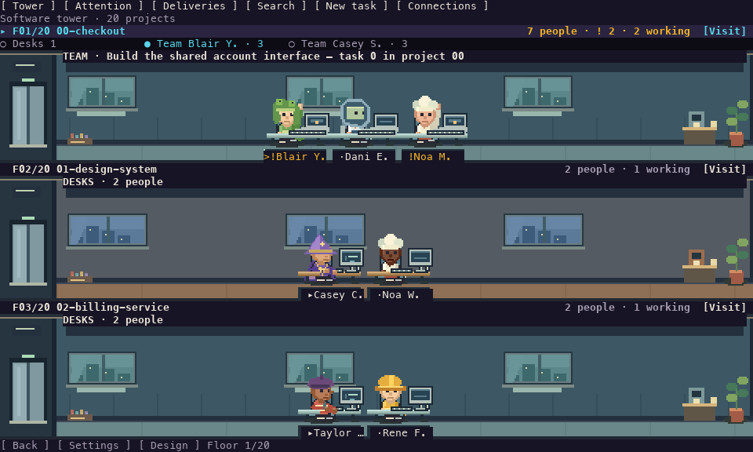
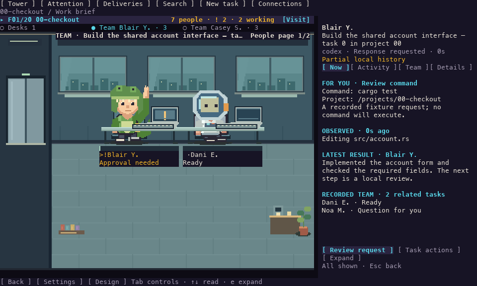

# they-work

> A virtual office for the AI coding agents already running on your machine.

You start three agents on a project and they scatter into separate threads.
`they-work` puts them back in one room: every thread is an employee at a desk,
typing, reading, editing, or waiting on you — drawn as pixel art in your
terminal. Each project occupies an independent floor in a software tower, so
you can see the whole company or inspect one worker's activity.

Observation reads selected local transcripts and databases. You can also create
tasks from the office: managed Codex tasks use an owning app-server connection;
Claude uses its official console and existing login. Historical records alone
never grant control over another running process. Provider actions can modify
project files and use the network, under that provider’s permissions. Collectors
keep their read-only boundary; SQLite may update an existing `-shm` coordination
sidecar, and a cold WAL store without existing sidecars is refused.

The tower and work-panel previews reconstruct the actual UI image layer and
native text mask with Menlo. They are compositor exports, not screenshots of a
terminal emulator. The [current audit](docs/design-audit/iteration-8/README.md) records tested
workflows and the remaining terminal/platform acceptance checks.

## Start here

Run a native terminal office on macOS, Linux, Windows, or WSL. From this
checkout, with Rust 1.90+ and a C compiler installed:

~~~sh
cargo install --locked --path crates/theywork-tui
they-work --demo
~~~

Press `q` to quit. The demo is an imaginary company and reads no conversation
data. To choose where your real conversations come from:

~~~sh
they-work --setup
~~~

Select Codex, Claude Code, both, or no local sources. This connects local
conversation folders; observation needs no account login or API key. Creating
tasks uses your provider’s normal installation and login. Each project
gets its own office floor and each conversation a worker you can inspect.

The [installation guide](INSTALL.md) covers compiler setup, custom data paths,
Windows PowerShell, WSL, and Docker. Native installers and a six-platform release
workflow are included on this branch; those assets have **not been published**.
The older `v0.1.0` image does not contain these changes.

For this version without local Rust, use Docker from a checkout:

~~~sh
make demo
make run
~~~

`make demo` mounts nothing. `make run` mounts existing conversation homes
read-only and disables network access. The first launch asks which local sources
may be read. Keep **Remember on this computer** selected to reconnect next time,
or turn it off for a temporary session. `they-work --doctor` checks chosen sources;
`they-work --once` prints projects and workers. Without a saved choice, add
`--sources all`, `codex`, or `claude`; no conversations are read without a choice.
For Docker, use `make run ARGS="--sources all --doctor"` or
`ARGS="--sources all --once"`.

## What you are looking at

| View | Key | What it is |
| --- | --- | --- |
| **The tower** | `0` | all projects and attention counts; the starting view when no floor is selected |
| **The floor** | `Enter` from the tower | one project's office, with a desk per conversation |
| **Work panel** | `Enter` | current work brief, Activity, Team and Details |
| **The phone** | `p` | Now, Attention, Edits and Messages from recorded conversations |
| **Find your team** | `/` or `Ctrl+K` | find a project or conversation by name, path, provider or state |
| **Notebook** | `b` | attention, deliveries and changes since your last visit; local reviewed markers |
| **Team** | `g` | recorded delegation, session membership and forks, with a collapsible tree |
| **Instruction** | `m` | compose inside the work panel with a fixed recipient |
| **New task** | `n` | select provider, project folder and instruction |
| **Connections** | `c` / `C` | sources, available controls and official provider login |
| **Settings** | `s` | theme, colour, motion, nameplates and mouse; older cameras in Advanced |
| **Help** | `?` | every key |
| **Appearance** | `d` / `a` | office design; character name, outfit and animation in the inspector |

`Tab` / `Shift+Tab` focus visible controls; arrows select items and `Enter`
opens or activates them. With the scene focused, `PageUp` / `PageDown` change
floors; `1`–`9` jump directly to one. `Esc` returns without losing the selected
worker. The tower shows multiple floors; enter one to see its detailed office.
Use `/` to search fictional names, real task titles, providers, states, observed
activity and recorded results. Matches open the relevant retained record.
In the inspector, arrows and `PageUp` / `PageDown` scroll the recorded context;
`Home` reaches the beginning; `End` returns to latest. New activity does not
move you away from an older record. Expand/Collapse, `e`, or `F7` changes panel
size without changing its recipient or draft. `!` finds a worker needing attention.
The panel keeps current requests separate from historical requests. Use Review
request for exact decisions and Task actions for interruption or reconnection.

Mouse clicks are enabled by default. Click a character, computer or nameplate to inspect,
then choose an explicitly available action. Opening a character never approves
its request. Disable capture in Settings or with `--mouse=off` for normal terminal
text selection. Capture is released in an official provider console and on exit.

Use `d` for the selected office's preset and four decoration zones. In the
inspector, `a` edits the fictional name, outfit and animation style. These are
local appearance choices and never change agent instructions. Changes preview
immediately; Apply keeps the edit and Cancel restores the previous appearance.
With Remember enabled, normal exit writes those appearance choices to disk.
`v` opens Advanced cameras. `w`/`W` and `o`/`O` retain compatible wardrobe and
legacy palette shortcuts; legacy palettes affect the older cameras.
Keep **Remember on this computer** enabled when connecting to save these choices
and the selected floor. `--no-save` keeps changes temporary. Git worktrees of the
same repository share one floor.

The side-cut graphics use original 24×32 overview and 48×64 office characters,
integer scaling, complete computers, seated hands, chairs, contact shadows and
furnished rooms. Independent desks use monitors; team tables use laptops. Clothes are decorative; the provider is
shown in the task inspector. An amber `!` remains at a worker’s label while an
alert is active. Questions, approvals, automatic review and missing recent
information have distinct notebook categories. A local “seen” mark never answers
a request. A recorded result can be marked reviewed without claiming that the
whole project is complete.

Confirmed delegation families share a meeting room while subtasks are active.
Nested relationships remain inspectable; groups paginate at a readable size.
Coffee, stretching and other decorative actions are reproducible, limited to two
per floor, and disabled with reduced motion. They do not generate transcript
messages or change task state. Kitty, iTerm2 and Sixel carry the graphics; other
terminals retain native text controls and the compatible compact views.

See [task controls](docs/CONTROLS.md) for managed runtimes, official Claude console
handoff, temporary mode and the exact limits of external-session control.

## What it reads, and what you are agreeing to

The collectors have a narrow, read-only input boundary:

- **Claude Code** — regular `.jsonl` session files below `~/.claude/projects/`.
  Symlinks and non-JSONL files are skipped.
- **Codex** — `state_5.sqlite` and `thread_history_1.sqlite` inside `~/.codex`
  or its `sqlite/` subdirectory, opened in SQLite's read-only mode. Each current
  root-level database takes priority over an older copy in `sqlite/`.

The main databases and transcripts are not changed. SQLite can coordinate
through an existing `-shm` sidecar when a native store is writable; the Docker
commands mount stores read-only, and the program refuses a cold WAL-mode store
whose required `-wal`/`-shm` sidecars are absent rather than creating them.

Those records contain your prompts, the commands your agents ran, file paths,
their messages back, thread titles, branches and token counts. All of it is
displayed on screen, so treat the terminal as having the same sensitivity as
those files. The collectors read filesystem metadata and `.git` markers to group
activity under a project root; they never read your project's source.

A missing agent is normal — the other one carries on. If a store lives somewhere
unusual, point `THEYWORK_CLAUDE_HOME` or `THEYWORK_CODEX_HOME` at it. Codex on
the Windows side while you run in WSL is common enough that discovery looks for
it under `/mnt/*/Users/*` on its own.

The flags in `make run` are deliberately visible:

- `--network none` — no external network connectivity; container loopback remains
- `--read-only` — the container filesystem cannot be written
- `--cap-drop ALL` and `--security-opt no-new-privileges`
- `readonly` on each existing agent mount
- `--user` your own uid, so it reads exactly what you can read and no more
- `--rm` — nothing persists when you quit

Building the image uses Docker's normal network access to pull base images. That
is separate from the running program, which has none.

## What is inside

Six crates. `theywork-core` is the contract; the collectors and the renderer
both depend on it and neither depends on the other.

| Crate | Does |
| --- | --- |
| `theywork-core` | the domain model — offices, workers, activities, events, status |
| `theywork-collect` | read-only readers for Claude Code and Codex |
| `theywork-control` | local Codex supervisor and verified native Claude handoff |
| `theywork-render` | the pixel canvas, sprites and views |
| `theywork-terminal-image` | Kitty, iTerm2 and Sixel transport for terminals that can show images |
| `theywork-tui` | the binary: arguments, discovery, the frame loop |

Observation data flows one way. A collector tails a transcript or reads a database and emits
normalised events; `World` folds those into offices and workers; the renderer
draws whatever `World` currently says. Explicit control commands travel through
the separate owning runtime; their receipts and provider events feed back into
the view. Collectors never write instructions into a history file.

Without a graphics protocol, the picture is built from **half-block, quadrant
or sextant characters**, whichever your terminal and font supports. Terminal
on macOS defaults to half blocks to avoid gaps in its usual font geometry.
Use Settings to compare encodings with your own font. The room adjusts to the
window and pages its workers when there is insufficient space for everyone.

When a graphics protocol is negotiated and the terminal reports its cell
geometry, the renderer makes one source pixel per physical terminal pixel in
the covered rectangle. Sixel, Kitty graphics, and iTerm2 inline PNG all receive
that renderer frame. For example, a 160×86 covered cell rectangle in a
terminal reporting 10×10-pixel cells produces a 1600×860 image. If the cell
geometry is unavailable, the program keeps the character renderer; the final
dimensions always come from the terminal report, not this example.

| Platform path | Status tested in this worktree |
| --- | --- |
| Windows Terminal under WSL, Sixel | Encoding and renderer frames are covered by tests. No Windows/WSL graphical terminal session was available for this audit, which ran on macOS. |
| macOS, Kitty protocol | Kitty encoding and the true-density renderer frame are covered by tests, but visual output was **not tested**: no Kitty graphics session was exercised; see the current audit for native macOS checks. |
| macOS, iTerm2 inline images | iTerm2 encoding and the true-density renderer frame are covered by tests, but visual output was **not tested**: no iTerm2 graphics session was exercised; see the current audit for native macOS checks. |

To verify a real terminal, run the demo in that terminal and look for a clean
pixel image rather than the character fallback. The diagnostics and supported
protocol selection are automatic; no protocol flag is required. Please report
the terminal application, version, cell size, image dimensions, and whether
the image appears or falls back to characters.

The intended design for every surface lives in [`docs/design/`](docs/design) as
plain HTML you can open in a browser. Where the code and a board disagree, the
board is what was meant.

## Configuration

| Flag | |
| --- | --- |
| `--mouse=off` | disable mouse capture; keep terminal text selection |
| `--setup` | choose local conversation sources |
| `--sources all\|codex\|claude\|none` | choose providers explicitly |
| `--codex-home <path>` / `--claude-home <path>` | set a local source root |
| `--project <path>` | restrict collection to one repository, including its worktrees |
| `--all` | start on the tower |
| `--demo` | the imaginary company; reads nothing |
| `--doctor` | report what was found, then exit |
| `--once` | report every office and worker, then exit |
| `--view iso\|top\|side` | starting camera |
| `--light` / `--dark` | starting appearance |
| `--color auto\|true\|256\|none` | colour depth |
| `--config-dir <path>` | override the default settings folder |
| `--no-save` | keep the session temporary; write no preferences |
| `--headless --exit-after <dur>` | run the loop without a terminal |

| Variable | |
| --- | --- |
| `THEYWORK_CLAUDE_HOME` | where Claude Code's data is |
| `THEYWORK_CODEX_HOME` | where Codex's data is |
| `TERM_PROGRAM` | forwarded to retain iTerm2's older capability fallback |
| `THEYWORK_ENCODING` | override character art: `sextants`, `quadrants`, or `half-blocks` |
| `THEYWORK_COLOR` | force a colour depth |
| `NO_COLOR` | honoured above everything else |

Sources are remembered when you confirm **Connect** with **Remember on this
computer** enabled. Settings use `$XDG_CONFIG_HOME/they-work` (or
`$HOME/.config/they-work`) on macOS/Linux/WSL, and `%APPDATA%\they-work` on
Windows. `--no-save` prevents writes; demo and noninteractive modes never save
preferences. See [installation and source setup](INSTALL.md#choose-your-conversation-sources).

## Working on it

~~~bash
make check   # format, clippy, and the full test suite
make shot    # render every surface beside its intended design
~~~

`make shot` writes `docs/shots/index.html`, which puts each rendered view next to
its design reference. That comparison is how visual changes get reviewed — the
frames are generated rather than stored, so what you open is always the code you
have checked out.

`scripts/cargo` uses local Rust when available, otherwise the Docker toolchain.
See [CONTRIBUTING.md](CONTRIBUTING.md).

## License

MIT
