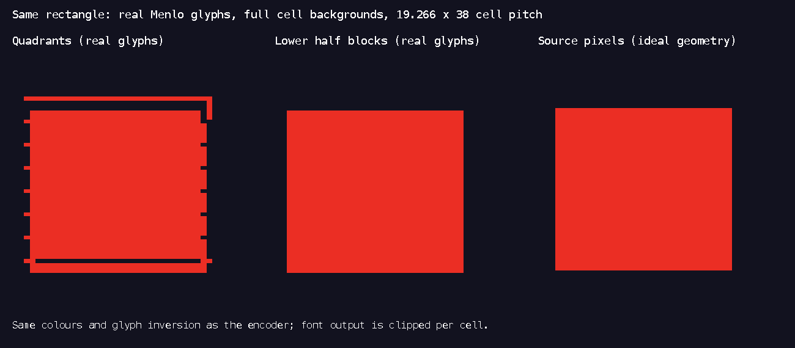

# Raster audit: the cracks were real

The first audit approved geometry reconstructions that replaced block glyphs
with rectangles. That workflow hid precisely the font gaps visible in the new
user screenshots. Its description of those gaps as artificial was wrong for a
terminal that renders the font's glyph outlines. `capture_visual.py` now names
its output an ideal geometry diagnostic and prints that limitation on every run.

Three separate causes were found. They must not be conflated: fixing Unicode
masks does not repair a font's metrics, and changing the encoding does not repair
an oversized sign or a misplaced floor tile.

## 1. Two valid sextant patterns were excluded

The six samples are numbered in reading order, `12 / 34 / 56`. The old encoder
correctly mapped the 60 characters in U+1FB00–U+1FB3B but excluded masks 21
(`135`, the left column) and 42 (`246`, the right column). Unicode represents
those patterns with the existing U+258C LEFT HALF BLOCK and U+2590 RIGHT HALF
BLOCK. Their absence from the sextant range does not make the patterns
unrepresentable. See the primary [Symbols for Legacy Computing chart](https://www.unicode.org/charts/PDF/U1FB00.pdf)
and [Block Elements chart](https://www.unicode.org/charts/PDF/U2580.pdf).

`check_unicode.py` reads the actual encoder table and obtains the meaning of each
character from Python's Unicode character names, independently of that table.
At baseline `8331017`, only 62 of 64 patterns were allowed. The two missing
patterns each required one wrong sample per cell, creating a regular tooth on
an otherwise straight edge. The current table permits all 64 and loses no
samples for any two-colour pattern. Quadrants were checked too: their bit order
and all 16 glyph mappings were correct.

The Rust regression uses the published sextant-number names as an independent
oracle and reconstructs the actual quantizer's output foreground/background for
all 80 quadrant/sextant input patterns. It would fail for the old missing
columns. The measurements are in `evidence/unicode-mapping.json`.

This was a real encoding bug, but it cannot alone explain a screenshot captured
in quadrant mode. The screenshots do not state their selected encoding or font.

## 2. Real font outlines leave gaps inside the terminal cell

`glyph_metrics.swift` renders the installed Menlo font with CoreText and records
the actual font used for every specimen. It does not replace block characters
with rectangles. At 32 points, Menlo-Regular has a 19.265625 horizontal advance
and 37.25 points of ascent plus descent. Its full block outline is only 32.625
points high. The font's upper and lower half blocks also occupy halves of that
outline, not halves of the line box. Sextant specimens fall back to LastResort
on this machine; installing Menlo does not provide sextant coverage.

The geometry specimen uses fixed 19.265625×38 cells, the renderer's actual
foreground/background inversion rule, full cell backgrounds, and clipping at
cell edges. The quadrant rectangle develops repeated teeth on its vertical
edges and detached horizontal stripes. It reproduces the characteristic failure
from the user screenshots even though all its quadrant masks are correct.



The middle rectangle uses the lower half block with **foreground = bottom,
background = top**. The background fills the line's leading above the glyph;
the lower block reaches the descent. Its rectangle is continuous. The previous
upper-block form exposed the bottom colour in the leading, creating a false
stripe above a horizontal boundary. Both forms encode identical two-pixel
colours in a terminal that renders ideal half blocks. This is an encoding choice
that improves the real font result without changing the source scene.

`Canvas::render` now uses that lower-block form. Automatic selection uses
half-blocks when `TERM_PROGRAM=Apple_Terminal`; explicit encoding settings and
capability hints still win. Other terminal detection remains unchanged. The
reason shown by diagnostics explains the font geometry choice and points to
Settings for comparison instead of recommending unsupported sextants.

The evidence establishes the installed font's behaviour, not the user's exact
font or Terminal.app's internal renderer. A terminal may synthesize block glyphs
or place baselines differently. No Terminal.app window was controlled: that app
was unavailable to computer use. The new real-font replay is explicitly labelled
as a replay of captured terminal cells, not a terminal screenshot.

## 3. Partial transparency could select the old text foreground

For a half-block containing only its bottom pixel, the old code set the
background colour while drawing `▄`; the glyph then used an unrelated existing
foreground. It now sets the foreground correctly.

For a partially transparent dense cell, the quantizer could invert its glyph
and choose `None` as foreground. That preserved the previous cell's text
foreground, although missing pixels should reveal the previous background.
Before quantization, missing samples now resolve to that background. Fully
transparent cells remain untouched. Regressions cover all 78 non-empty partial
quadrant/sextant patterns and all nine top/bottom pairs made from two colours or
transparency.

## Full-frame review

The complete side and isometric preview buffers at 192×58 were replayed with
Menlo-Regular/Menlo-Bold at 18 points and 11×21 cell pitch. Both used only those
two fonts, with no LastResort glyphs. Lower-block edges remained continuous in
the title, windows, faces and furniture.

The review still rejected four composition defects visible in both ideal and
real-font output: clouds escaping the side windows, the isometric rug extending
outside the viewport, dark internal floor seams, and a small `K` that read as
`E`. Those findings were sent to the scene lane. They are scene defects, not
reasons to change the codec again. The reviewed preview is intermediate evidence;
the main iteration report records the final scenes after those corrections.

## Reproduction

The two-colour mapping check is portable and reads the baseline without checking
out another revision:

```sh
python3 docs/design-audit/iteration-2/check_unicode.py
sh docs/design-audit/native-cargo.sh test -p theywork-render canvas::tests --lib
```

The installed-font probe runs on macOS with Swift and CoreText. Scratch module
caches remain in the ignored audit directory:

```sh
swift -module-cache-path docs/design-audit/tmp/iteration-2/swift-cache \
  docs/design-audit/iteration-2/glyph_metrics.swift \
  docs/design-audit/iteration-2/evidence/menlo-coretext
```

For full frames, pass the JSON cells exported by the native PTY harness:

```sh
swift -module-cache-path docs/design-audit/tmp/iteration-2/swift-cache \
  docs/design-audit/iteration-2/glyph_metrics.swift OUTPUT_PREFIX INPUT.cells.json 18
```

The JSON format is `{columns, rows, cells: [[{text, fg, bg, bold}, ...], ...]}`;
colours are resolved `#rrggbb` values. The output includes a PNG plus `.font.json`
with font runs, unsupported glyphs, font metrics and the exact replay method.
PNG colours use sRGB. Cell backgrounds are filled independently of the font;
text is drawn by CoreText and clipped to the cell. Large JSON buffers and module
caches are reproducible intermediates and are ignored.

`evidence/canvas-tests.log` records 20 passing focused tests. The final workspace
suite and visual snapshots are run after all scene and character changes join
this work. A golden update is not proof that a real font can render a scene.
